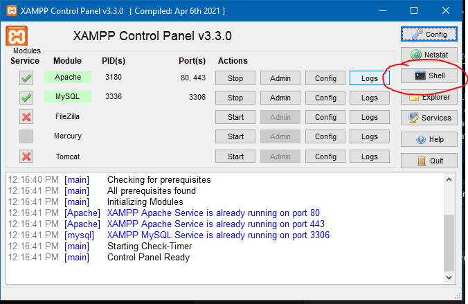
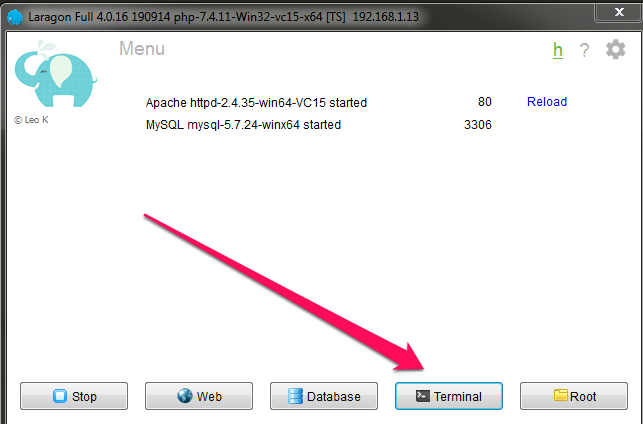
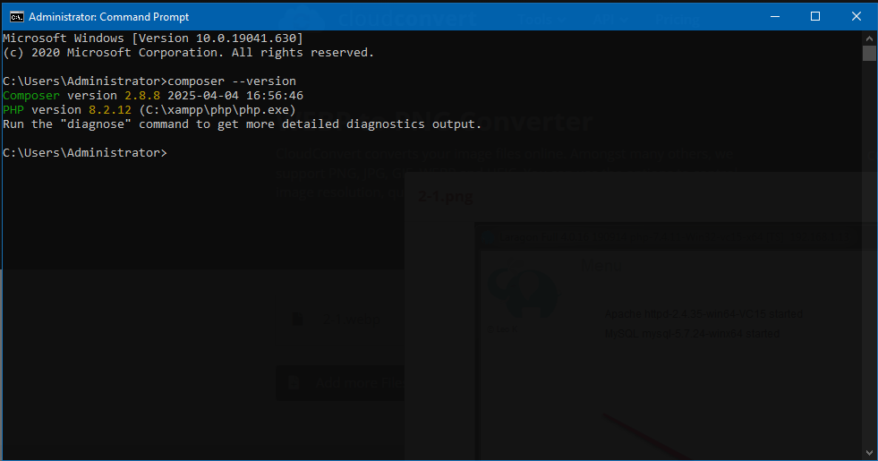
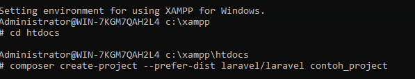
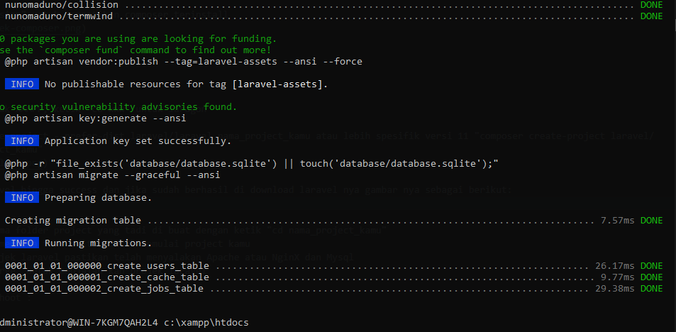
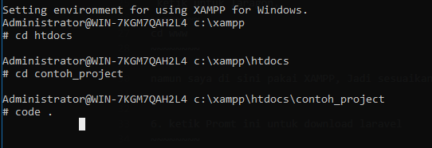
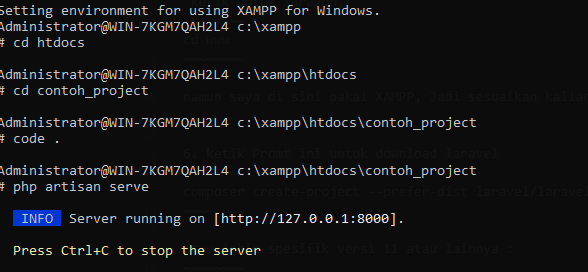
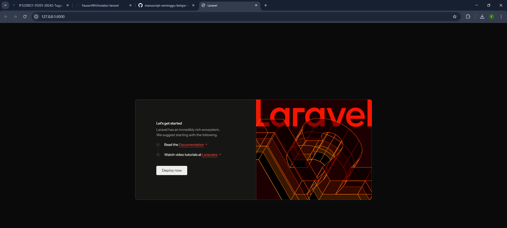

# PERSIAPAN INSTALASI LARAVEL 11 MENGGUNAKAN COMPOSER

1. Sebelum Instalasi Framework Laravel, pastikan dulu sudah terinstall Web server seperti laragon atau XAMPP 
2. Setelah itu download dan install COMPOSER di [composer-setup.exe](https://getcomposer.org/Composer-Setup.exe) dan jalankan file instalasi. agar bisa menajalan kan composer di terminal atau command Prompt
3. buka aplikasi web server seperti laragon atau XAMPP, lalu buka menu terminal atau shell

   
   

4. ketik di bawah ini untuk memastikan composer terinstall

   ~~~~~~~~
   composer --version
   ~~~~~~~~ 

   

## INSTALASI LARAVEL

5. Buka terminal atau Shell di Xampp atau laragon, ketik di bawah ini untuk XAMPP

   ~~~~~~~~
   cd htdocs
   ~~~~~~~~

   ketik untuk laragon,

   ~~~~~~~~
   cd www
   ~~~~~~~~ 

   namun saya di sini pakai XAMPP, Jadi sesuaikan kalian pakai web server dari laragon atau XAMPP. dan pastikan sudah di arahkan ke direktori htdocs atau www

6. ketik Promt ini untuk download laravel

   ~~~~~~~~
   composer create-project --prefer-dist laravel/laravel nama_project_kamu
   ~~~~~~~~ 

   atau lebih spesifik versi 11 atau lainnya :

   ~~~~~~~~
   composer create-project laravel/laravel:^11.0 nama_project_kamu
   ~~~~~~~~ 

   

7. tunggu instalasi laravel hingga success dan jika sudah berhasil di download laravel nya gambar nya sebagai berikut:

   

8. masuk ke direktori nama folder project yang tadi di buat dengan ketik

   ~~~~~~~~
   cd nama_project_kamu
   ~~~~~~~~ 

9. Ketik promnt ini untuk membuka text editor untuk memulai project kamu

   ~~~~~~~~
   code .
   ~~~~~~~~ 

   

10. Untuk menjalankan projek laravel pastikan telah menyalakan Apache atau NginX dan Mysql
11. Ketik promt ini untuk menjalan kan projek laravel 

    ~~~~~~~~
    php artisan serve
    ~~~~~~~~ 

    

12. Dan laravel sudah selesai di jalankan dan siap di build sesuai kebutuhan project...

    


# SETUP LARAVEL .ENV DAN MIGRATION & SEEDER

### Setup .env

1. Buat database baru via phpMyAdmin, Akses: [localhost](http://127.0.0.1/phpmyadmin) atau ketik di browser: 
   ```bash
   http://127.0.0.1/phpmyadmin
   ```

2. Klik New, beri nama misalnya db_laravel, lalu klik Create.
3. Buka file .env di root proyek Laravel kamu, lalu ubah konfigurasi berikut:
   ```bash
   DB_CONNECTION=mysql
   DB_HOST=127.0.0.1
   DB_PORT=3306
   DB_DATABASE=db_laravel
   DB_USERNAME=root
   DB_PASSWORD=
   ```

### Setup Migration 
1. Jalankan perintah ini di terminal proyek (buka terminal di Visual Studio Code saat membuka proyek Laravel):
   ```bash
   php artisan make:migration create_bank_accounts_table --create=bank_accounts
   ```

2. Edit file migration yang dibuat di direktori database/migrations/, misalnya seperti ini:
   ```php
   Schema::create('bank_accounts', function (Blueprint $table) {
       $table->id();
       $table->unsignedBigInteger('user_id');
       $table->string('bank_name', 255);
       $table->string('account_number', 255);
       $table->enum('status', ['active', 'inactive'])->default('active');
       $table->timestamps();

       $table->foreign('user_id')->references('id')->on('users')->onDelete('cascade');
   });
   ```

3. Edit juga migration create_users_table.php, tambahkan kolom role:
   ```php
   $table->enum('role', ['admin', 'user'])->default('user');
   ```

4. Jalankan perintah ini untuk mengeksekusi migration:
   ```bash
   php artisan migrate
   ```

### Setup Seeder
1. Buat file seeder di terminal:
   ```bash
   php artisan make:seeder UsersTableSeeder
   php artisan make:seeder BankAccountsTableSeeder
   ```

2. Edit isi seeder: 

   UsersTableSeeder.php
   ```php
   DB::table('users')->insert([
       [
           'name' => 'Admin',
           'email' => 'admin@example.com',
           'email_verified_at' => now(),
           'password' => Hash::make('password123'),
           'role' => 'admin',
           'remember_token' => Str::random(10),
           'created_at' => now(),
           'updated_at' => now()
       ],
       [
           'name' => 'User',
           'email' => 'user@example.com',
           'email_verified_at' => now(),
           'password' => Hash::make('password123'),
           'role' => 'user',
           'remember_token' => Str::random(10),
           'created_at' => now(),
           'updated_at' => now()
       ]
   ]);
   ```

   BankAccountsTableSeeder.php
   ```php
   DB::table('bank_accounts')->insert([
       [
           'user_id' => 1,
           'bank_name' => 'Bank Central Asia',
           'account_number' => '1234567890',
           'status' => 'active',
           'created_at' => now(),
           'updated_at' => now()
       ],
       [
           'user_id' => 2,
           'bank_name' => 'Bank Negara Indonesia',
           'account_number' => '9876543210',
           'status' => 'inactive',
           'created_at' => now(),
           'updated_at' => now()
       ]
   ]);
   ```

3. Jalankan seeder:
   ```bash
   php artisan db:seed --class=UsersTableSeeder
   php artisan db:seed --class=BankAccountsTableSeeder
   ```


 
